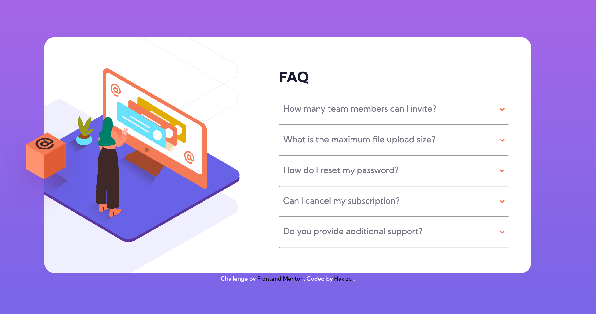
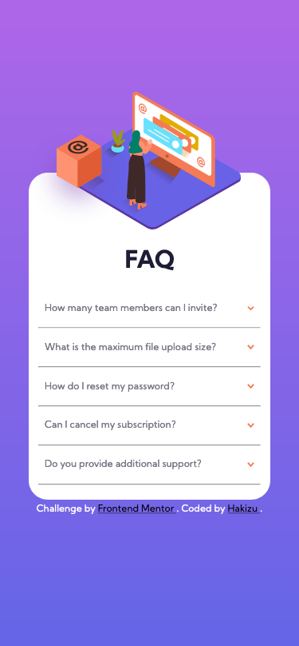

# Frontend Mentor - FAQ accordion card solution

This is a solution to the [FAQ accordion card challenge on Frontend Mentor](https://www.frontendmentor.io/challenges/faq-accordion-card-XlyjD0Oam). Frontend Mentor challenges help you improve your coding skills by building realistic projects. 

## Table of contents

- [Overview](#overview)
  - [The challenge](#the-challenge)
  - [Screenshot](#screenshot)
  - [Links](#links)
- [My process](#my-process)
  - [Built with](#built-with)
  - [Useful resources](#useful-resources)
- [Author](#author)

**Note: Delete this note and update the table of contents based on what sections you keep.**

## Overview

### The challenge

Users should be able to:

- View the optimal layout for the component depending on their device's screen size
- See hover states for all interactive elements on the page
- Hide/Show the answer to a question when the question is clicked

### Screenshot
Desktop

Desktop Active

Mobile

### Links

- Solution URL: [Github Repo](https://github.com/Hakizu/FrontendChallenge)
- Live Site URL: [Netlify](https://pedantic-panini-6aea52.netlify.app/)

### Built with

- Semantic HTML5 markup
- CSS custom properties
- SCSS
- Flexbox
- Mobile-first workflow

### Useful resources

- [Flavio Copes](https://flaviocopes.com/how-to-add-event-listener-multiple-elements-javascript/) - Helpful article to add event listener to accordion-items

## Author

- Hakizu - (https://www.github.com/hakizu)
